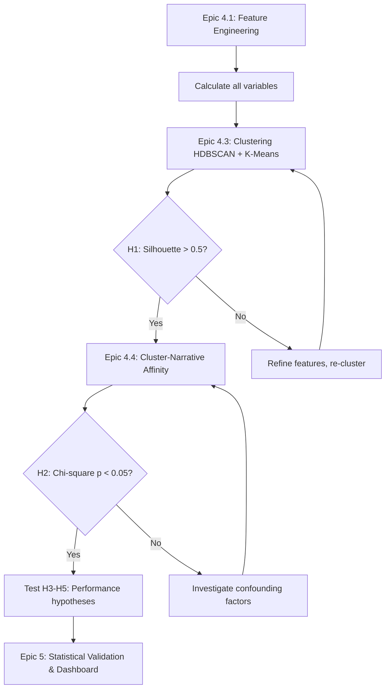

# Research Hypotheses - Crypto Narrative Hunter
**Master Thesis - SmartAgent AI**

**Version:** 1.0
**Date:** October 8, 2025
**Status:** Active - Methodological Foundation

---

## Purpose

This document defines the formal research hypotheses for the Crypto Narrative Hunter thesis project. It directly addresses **Tutor Question 1: "What do you want to answer or predict?"** by translating research questions into testable hypotheses with clear statistical validation methods.

---

## Research Context

**Primary Goal:** Identify and characterize behavioral archetypes within the smart money investor population and analyze their narrative preferences.

**Approach:** Unsupervised machine learning (clustering) applied to wallet-level behavioral features derived from on-chain transaction data, balance snapshots, and portfolio composition.

**Sample:** 2,343 wallets with complete transaction data (Sept 3 - Oct 3, 2025) representing 9.31% of the 25,161-wallet smart money population.

---

## Primary Research Questions

1. **RQ1 - Archetype Discovery:** Can we identify distinct smart money wallet archetypes based on trading behavior, risk profiles, and portfolio strategies?

2. **RQ2 - Narrative Affinity:** Do specific wallet archetypes show statistically significant preferences for certain crypto narratives (AI, DeFi, Gaming, Meme, Infrastructure)?

3. **RQ3 - Early Adoption Advantage:** Do early narrative adopters (wallets entering positions within 30 days of token launch) achieve higher risk-adjusted returns than late adopters?

4. **RQ4 - Portfolio Strategy:** How does portfolio concentration (measured by HHI) correlate with performance metrics (ROI, Sharpe ratio)?

5. **RQ5 - Behavioral Patterns:** What accumulation/distribution patterns distinguish high-performing wallets from average performers?

---

## Formal Hypotheses

### H1: Wallet Clustering (Archetype Discovery)

**Null Hypothesis (H0₁):**
Smart money wallets do not form distinct behavioral clusters. Any observed groupings are random and lack statistical significance.

**Alternative Hypothesis (Hₐ₁):**
Smart money wallets cluster into 3-5 distinct archetypes with statistically significant separation in feature space.

**Statistical Test:**
- **Primary:** Silhouette Score (target: > 0.5 indicates well-separated clusters)
- **Secondary:** Davies-Bouldin Index (target: < 1.0 indicates compact, well-separated clusters)
- **Tertiary:** Calinski-Harabasz Score (higher = better; use for relative comparison)

**Acceptance Criteria:**
- Silhouette Score ≥ 0.5 across all clusters
- At least 3 clusters with n ≥ 100 wallets each
- Clusters interpretable with domain knowledge (not random noise)

**Validation Method:**
- Bootstrap sampling (1,000 iterations) → Adjusted Rand Index (ARI) > 0.7 indicates stable clusters
- Cross-validate with Tier 2 wallet population (22,818 wallets) using pool participation data

**Expected Outcome:**
Identify 3-5 archetypes such as:
- "Early Narrative Adopter" (high conviction, low diversity)
- "Diversified DeFi Farmer" (high diversity, moderate risk)
- "Meme Speculator" (high frequency, short holding periods)
- "Infrastructure Investor" (low frequency, long holding periods)

---

### H2: Cluster-Narrative Affinity

**Null Hypothesis (H0₂):**
Wallet cluster membership and narrative preference are independent. Clusters show no statistically significant preference for specific narrative categories.

**Alternative Hypothesis (Hₐ₂):**
Specific wallet clusters exhibit statistically significant preferences for certain crypto narratives (e.g., "Meme Speculator" cluster overweights Meme tokens).

**Statistical Test:**
- **Chi-Square Test of Independence** (Cluster × Narrative contingency table)
- α = 0.05 (significance level)
- Effect size: Cramér's V (small: 0.1, medium: 0.3, large: 0.5)

**Acceptance Criteria:**
- p-value < 0.05 (reject H0, accept Hₐ)
- Cramér's V ≥ 0.3 (medium effect size)
- At least 2 clusters with >20% portfolio allocation to a single narrative category

**Validation Method:**
- Post-hoc pairwise comparisons with Bonferroni correction
- Cross-validate with Tier 2 aggregate pool participation data

**Expected Outcome:**
Statistically significant affinity matrix showing cluster-narrative associations (e.g., Cluster 1 → AI tokens, Cluster 2 → DeFi, Cluster 3 → Meme).

---

### H3: Early Adoption Performance Advantage

**Null Hypothesis (H0₃):**
Early narrative adopters (positions opened <30 days after token launch) do not achieve significantly higher risk-adjusted returns than late adopters (>30 days).

**Alternative Hypothesis (Hₐ₃):**
Early narrative adopters achieve statistically significant higher Sharpe ratios and ROI% compared to late adopters.

**Statistical Test:**
- **Independent t-test** (if normally distributed) OR **Mann-Whitney U test** (if non-parametric)
- α = 0.05 (significance level)
- Effect size: Cohen's d (small: 0.2, medium: 0.5, large: 0.8)

**Acceptance Criteria:**
- p-value < 0.05
- Cohen's d ≥ 0.5 (medium effect size)
- Early adopters show ≥20% higher median ROI%

**Validation Method:**
- Stratify by narrative category (test per narrative to control for confounding)
- Control for wallet size (volume-matched cohorts)

**Expected Outcome:**
Early adopters outperform late adopters with medium-to-large effect size, particularly in high-volatility narratives (AI, Meme, Gaming).

---

### H4: Portfolio Concentration vs Performance

**Null Hypothesis (H0₄):**
Portfolio concentration (Herfindahl-Hirschman Index) has no significant correlation with risk-adjusted returns (Sharpe ratio).

**Alternative Hypothesis (Hₐ₄):**
Portfolio concentration exhibits a statistically significant non-linear relationship with Sharpe ratio (inverted U-curve: moderate concentration optimal).

**Statistical Test:**
- **Pearson correlation** (linear relationship)
- **Polynomial regression** (quadratic term to test for inverted U-curve)
- α = 0.05 (significance level)

**Acceptance Criteria:**
- Linear correlation |r| > 0.3 OR
- Quadratic regression R² > 0.2 with significant β₂ coefficient (p < 0.05)

**Validation Method:**
- Stratify by cluster (test if relationship holds within archetypes)
- Control for total portfolio value and trade frequency

**Expected Outcome:**
Moderate concentration (HHI: 0.3-0.5) yields optimal risk-adjusted returns. Very low (over-diversified) and very high (concentrated bets) both underperform.

---

### H5: Accumulation Patterns & Performance

**Null Hypothesis (H0₅):**
Wallets that accumulate tokens during price dips ("add-on-dips" behavior) do not achieve significantly higher returns than wallets without this pattern.

**Alternative Hypothesis (Hₐ₅):**
Wallets exhibiting add-on-dips behavior (accumulation bias > 0.6 during -10% price drops) achieve statistically significant higher ROI%.

**Statistical Test:**
- **Independent t-test** OR **Mann-Whitney U test**
- α = 0.05 (significance level)
- Effect size: Cohen's d ≥ 0.5

**Acceptance Criteria:**
- p-value < 0.05
- Add-on-dips wallets show ≥15% higher median ROI%
- Pattern observed in ≥20% of high-performing wallets (top quartile by ROI)

**Validation Method:**
- Use daily balance snapshots (70,290 snapshots) to detect accumulation events
- Cross-reference with ETH price drops (from eth_prices.csv)
- Control for overall position size and holding period

**Expected Outcome:**
Wallets with consistent add-on-dips behavior (conviction buyers) outperform reactive sellers, particularly in high-volatility narratives.

---

## Exploratory Hypotheses (Lower Priority)

### H6: Narrative Rotation Frequency

**Hypothesis:** High narrative rotation frequency (>5 narrative switches per month) correlates with lower risk-adjusted returns due to increased gas costs and poor market timing.

**Test:** Correlation analysis (Narrative Rotation Frequency vs Sharpe Ratio)

---

### H7: Gas Efficiency

**Hypothesis:** Wallets in the top quartile of gas efficiency (lowest gas cost per $1 traded) achieve higher net ROI% than bottom quartile.

**Test:** Independent t-test (Top vs Bottom quartile gas efficiency → Net ROI%)

---

## Hypothesis Testing Workflow

---

## Statistical Power Analysis

### Sample Size Justification

**Tier 1 Analysis (2,343 wallets):**
- **Clustering:** For k=5 clusters, n=2,343 provides >95% confidence (>450 wallets/cluster)
- **Chi-square:** For 5×7 contingency table (5 clusters × 7 narratives), minimum n=175 (achieved: 2,343 ✅)
- **t-tests:** For Cohen's d=0.5, α=0.05, power=0.80 → minimum n=64 per group (achieved ✅)

**Tier 2 Validation (22,818 wallets):**
- Aggregate validation provides population-level validation
- Sufficient for cross-validation of Tier 1 findings

---

## Limitations & Assumptions

### Data Limitations
1. **Temporal Scope:** 1-month window (Sept 3 - Oct 3, 2025) limits long-term performance analysis
2. **Transaction Coverage:** 9.31% of total population (2,343 of 25,161 wallets) - addressed via statistical validation
3. **Narrative Classification:** 65.6% of tokens require manual review (Epic 4.2 addresses this)

### Statistical Assumptions
1. **Independence:** Wallets assumed to be independent actors (not coordinated trading groups)
2. **Stationarity:** Market conditions assumed stable within 1-month window
3. **No Survivorship Bias:** Smart money definition filters active wallets, may exclude failed strategies

### Methodological Constraints
1. **Causality:** Clustering identifies associations, not causal relationships
2. **Generalizability:** Findings limited to Ethereum DeFi ecosystem (Sept-Oct 2025)
3. **Feature Selection:** Behavioral features reflect on-chain data only (no off-chain sentiment, news, or social signals)

---

## Expected Contributions to Field

### Academic Contributions
1. **Novel Methodology:** First application of unsupervised clustering to smart money wallet behavior in crypto markets
2. **Narrative Framework:** Introduces crypto narrative preferences as clustering dimension
3. **Behavioral Taxonomy:** Creates replicable framework for investor archetype classification

### Practical Contributions
1. **Investment Strategy:** Identifies characteristics of high-performing wallets (actionable insights)
2. **Risk Profiling:** Maps risk-return profiles across wallet archetypes
3. **Early Signal Detection:** Validates early adoption advantage hypothesis

---

## Alignment with Tutor Questions

| Tutor Question | Document Section |
|----------------|------------------|
| **1. What do you want to answer?** | Research Questions (RQ1-RQ5) |
| **2. What output do you expect?** | Expected Outcomes in H1-H5 |
| **4. What type of problem is this?** | Research Context (Unsupervised Clustering) |
| **6. How will you measure success?** | Statistical Tests & Acceptance Criteria |

---

## Next Steps

1. ✅ **Epic 4.1:** Calculate all features defined in FEATURE_ENGINEERING_SPEC.md
2. ✅ **Epic 4.2:** Manual narrative classification (328 "Other" tokens)
3. ✅ **Epic 4.3:** Run clustering algorithms → Test H1
4. ✅ **Epic 4.4:** Cluster-narrative affinity analysis → Test H2
5. ✅ **Epic 5:** Test H3-H5 with performance data
6. ✅ **Epic 6:** Document findings, limitations, implications

---

## References

### Internal Documents
- `MVP_STRATEGY.md` - Strategic approach and sample size justification
- `FEATURE_ENGINEERING_SPEC.md` - Variable definitions and calculations
- `MODEL_EVALUATION_FRAMEWORK.md` - Detailed metric specifications
- `DATA_DICTIONARY.md` - Data schema and quality assessment

### Statistical Methods
- Clustering: Rousseeuw (1987) - Silhouette coefficient
- Chi-square: Pearson (1900) - Contingency table tests
- Effect sizes: Cohen (1988) - Statistical power analysis
- Bootstrap validation: Efron & Tibshirani (1993)

---

## Document Version Control

| Version | Date | Changes | Author |
|---------|------|---------|--------|
| 1.0 | Oct 8, 2025 | Initial hypothesis document | Dev Agent |

---

**Status:** ACTIVE - Guides Epic 4-6 execution and thesis methodology chapter
**Next Review:** After Epic 4.3 (clustering results available)
